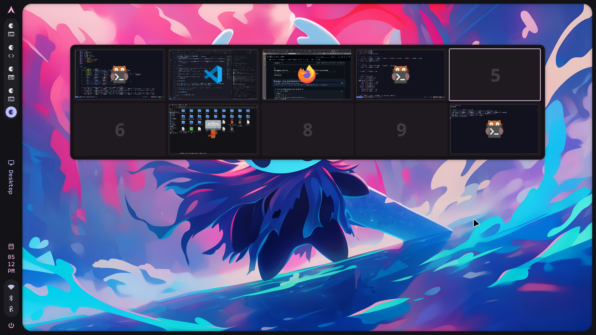

# Quickshell Overview for Hyprland

<div align="center">

A standalone workspace overview module for Hyprland using Quickshell - shows all workspaces with live window previews, drag-and-drop support, and Super+Tab keybind.


</div>

---

## 📸 Preview



https://github.com/user-attachments/assets/79ceb141-6b9e-4956-8e09-aaf72b66550c

> *Workspace overview showing live window previews with drag-and-drop support*

---

## ✨ Features

- 🖼️ Visual workspace overview showing all workspaces and windows
- 🎯 Click windows to focus them
- 🖱️ Middle-click windows to close them  
- 🔄 Drag and drop windows between workspaces
- ⌨️ Keyboard navigation (Left/Right arrows to switch workspaces, Escape to close)
- 💡 Hover tooltips showing window information
- 🎨 Material Design 3 theming
- ⚡ Smooth animations and transitions

## 📦 Installation

### Prerequisites

- **Hyprland** compositor
- **Quickshell** ([installation guide](https://quickshell.org/docs/v0.1.0/guide/install-setup/))
- **Qt 6** with modules: QtQuick, QtQuick.Controls, Qt5Compat.GraphicalEffects

### Setup

1. **Clone this repository** to your Quickshell config directory:
   ```bash
   git clone https://github.com/Shanu-Kumawat/quickshell-overview ~/.config/quickshell/overview
   ```

2. **Add keybind** to your Hyprland config (`~/.config/hypr/hyprland.conf`):
   ```conf
   bind = Super, TAB, exec, qs ipc -c overview call overview toggle
   ```

3. **Auto-start** the overview (add to Hyprland config):
   ```conf
   exec-once = qs -c overview
   ```

4. **Reload Hyprland**:
   ```bash
   hyprctl reload
   ```

### Manual Start (if needed)

```bash
qs -c overview &
```

## 🎮 Usage

| Action | Description |
|--------|-------------|
| **Super + Tab** | Toggle the overview |
| **Left/Right Arrow Keys** | Navigate between workspace groups |
| **Escape** | Close the overview |
| **Click workspace** | Switch to that workspace |
| **Click window** | Focus that window |
| **Middle-click window** | Close that window |
| **Drag window** | Move window to different workspace |

## ⚙️ Configuration

### Workspace Grid

Edit `~/.config/quickshell/overview/common/Config.qml`:

```qml
property QtObject overview: QtObject {
    property int rows: 2        // Number of workspace rows
    property int columns: 5     // Number of workspace columns (10 total workspaces)
    property real scale: 0.16   // Overview scale factor (smaller = more compact)
    property bool enable: true
}
```

### Theme & Colors

Edit `~/.config/quickshell/overview/common/Appearance.qml` to customize:
- Colors (m3colors and colors objects)
- Font families and sizes  
- Animation curves and durations
- Border radius values

## 📋 Requirements

- **Hyprland** compositor (tested on latest versions)
- **Quickshell** (Qt6-based shell framework)
- **Qt 6** with the following modules:
  - QtQuick
  - QtQuick.Controls
  - QtQuick.Layouts
  - Qt5Compat.GraphicalEffects
  - Quickshell.Wayland
  - Quickshell.Hyprland

## 🚫 Removed Features (from original illogical-impulse)

The following features were removed to make it standalone:

- App search functionality
- Emoji picker
- Clipboard history integration
- Search widget
- Integration with the full illogical-impulse shell ecosystem

## 📁 File Structure

```
~/.config/quickshell/overview/
├── shell.qml                      # Main entry point
├── README.md                      # This file
├── hyprland-config.conf          # Configuration reference
├── common/
│   ├── Appearance.qml            # Theme and styling
│   ├── Config.qml                # Configuration options
│   ├── functions/
│   │   └── ColorUtils.qml        # Color manipulation utilities
│   └── widgets/
│       ├── StyledText.qml        # Styled text component
│       ├── StyledRectangularShadow.qml
│       ├── StyledToolTip.qml
│       └── StyledToolTipContent.qml
├── services/
│   ├── GlobalStates.qml          # Global state management
│   └── HyprlandData.qml          # Hyprland data provider
└── modules/
    └── overview/
        ├── Overview.qml          # Main overview component
        ├── OverviewWidget.qml    # Workspace grid widget
        └── OverviewWindow.qml    # Individual window preview
```

## 🎯 IPC Commands

```bash
# Toggle overview
qs ipc -c overview call overview toggle

# Open overview
qs ipc -c overview call overview open

# Close overview  
qs ipc -c overview call overview close
```

## 🐛 Known Issues

- Window icons may fallback to generic icon if app class name doesn't match icon theme
- Potential crashes during rapid window state changes due to Wayland screencopy buffer management

## 💡 Tips

1. **Adjust scale**: If workspaces are too large or small, modify `scale` in Config.qml (default: 0.16)
2. **More workspaces**: Increase `rows` or `columns` to show more workspaces at once
3. **Custom colors**: Edit the `m3colors` object in Appearance.qml to match your theme
4. **Faster animations**: Reduce duration values in `animation` objects in Appearance.qml

## 🙏 Credits

Extracted from the overview feature in [illogical-impulse](https://github.com/end-4/dots-hyprland) by [end-4](https://github.com/end-4).

Adapted as a standalone component for Hyprland + Quickshell users who want just the overview functionality.

---

<div align="center">

**Note:** This is a personal project shared with the community. It works well for my setup, but I'm not actively maintaining it. Feel free to fork and adapt it to your needs!

Made with ❤️ for the Hyprland community

</div>
